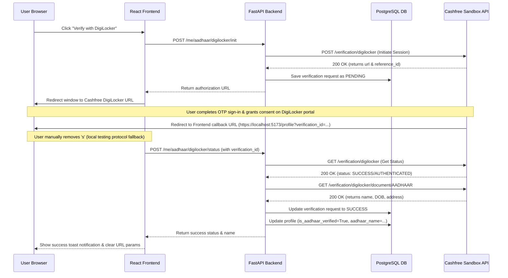

# Technical Documentation: DigiLocker Aadhaar Verification Integration

This document outlines the design, architecture, API schemas, database storage, and developer workflows implemented for the consent-based DigiLocker Aadhaar verification using Cashfree Secure ID.

---

## 1. Overview
Due to the deprecation of legacy OTP-based Offline Aadhaar Verification (OKYC) by UIDAI and Cashfree, the verification flow was migrated to the government-approved, consent-based **DigiLocker** verification. 

### Why DigiLocker?
* **Compliance:** Fully compliant with the Digital Personal Data Protection (DPDP) Act.
* **Security:** Users log in securely to their own official DigiLocker profiles using their mobile/Aadhaar number and an OTP.
* **Accuracy:** Directly fetches verified, digitally-signed official documents.

---

## 2. Architecture & Workflow

The integration follows a secure, decoupled redirection-callback architecture:



---

## 3. Database Schema

Verification records are tracked using the existing `aadhaar_verifications` table:

| Field Name | Type | Constraints | Description |
| :--- | :--- | :--- | :--- |
| `id` | Integer | Primary Key | Unique row identifier |
| `user_id` | Integer | Index | Links to the user profile |
| `ref_id` | String | Index, Unique | Stores the `verification_id` generated for the request |
| `status` | String | | `PENDING`, `SUCCESS`, or `FAILED` |
| `error_message` | Text | Nullable | Captures logic failures or errors returned by Cashfree |
| `created_at` | DateTime | Server default `now()` | Timestamp of initiation |
| `updated_at` | DateTime | Server default `now()` | Timestamp of last status change |

---

## 4. API Reference

### Backend Endpoints

#### 1. Initiate DigiLocker Session
* **Endpoint:** `POST /api/city/users/me/aadhaar/digilocker/init`
* **Request Schema (`DigiLockerInitRequestSchema`):**
  ```json
  {
    "redirect_url": "https://localhost:5173/profile"
  }
  ```
* **Response Schema (`DigiLockerInitResponseSchema`):**
  ```json
  {
    "verification_id": "dl_verify_5_1784702915",
    "reference_id": 64887,
    "url": "https://verification-test.cashfree.com/dgl?shortCode=j4tok...",
    "status": "PENDING",
    "redirect_url": "https://localhost:5173/profile"
  }
  ```

#### 2. Verify Session Status
* **Endpoint:** `POST /api/city/users/me/aadhaar/digilocker/status`
* **Request Schema (`DigiLockerStatusRequestSchema`):**
  ```json
  {
    "verification_id": "dl_verify_5_1784702915"
  }
  ```
* **Response Schema (`DigiLockerStatusResponseSchema`):**
  ```json
  {
    "status": "SUCCESS",
    "verification_id": "dl_verify_5_1784702915",
    "reference_id": 64887,
    "name": "Mallesh Fakkirappa Dollin",
    "message": "Aadhaar verified successfully."
  }
  ```

---

## 5. Frontend Implementation Details

The frontend logic in `ProfilePage.jsx` coordinates the redirection and state parsing:

1. **Initiation Function (`handleVerifyWithDigiLocker`):**
   * Prepares the target origin dynamically: maps current domain/port and forces the `https://` prefix (required by Cashfree).
   * Requests session details from `/init` and redirects `window.location.href` to the sandbox page.

2. **Mount Hook (`useEffect`):**
   * Inspects `window.location.search` for `verification_id`.
   * Triggers the backend `/status` API to verify user consent and synchronize records.
   * Cleans the query parameters from the history state once finished using `navigate('/profile', { replace: true })`.

---

## 6. Testing & Sandbox Guidelines

### Protocol Mismatch Bypass (Local Development Only)
Cashfree's API strictly enforces that the callback URL begins with `https://`. Since local dev servers like Vite run on plain `http://localhost:5173`:
1. The user completes authentication.
2. The browser is sent back to `https://localhost:5173/profile?verification_id=...`.
3. The connection resets (ERR_CONNECTION_RESET) because the local port does not support SSL.
4. **Resolution:** Manually edit the browser address bar to remove the `s` from `https://` (changing it to `http://`) and press Enter.

### Test Profiles
In the Sandbox/Test environment, Cashfree returns pre-populated test data. All successful verifications will show:
* **Verified Identity Name:** `Mallesh Fakkirappa Dollin`

### Production Readiness Check
* Change settings in your `.env` configuration:
  * `CASHFREE_BASE_URL=https://api.cashfree.com` (Production endpoint)
  * `CASHFREE_ENV=production`
  * Provide active production `CASHFREE_CLIENT_ID` and `CASHFREE_CLIENT_SECRET`.
* Ensure your website is hosted on a secure domain (`https://...`) to prevent protocol mismatch errors during callback redirection.
